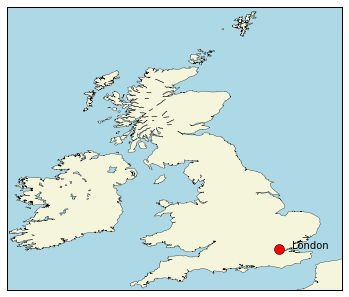

## Introduction

Python and Jupyter notebooks are becoming popular for reproducible
data science.

I wanted something similar for geographical information systems and
photogrammetry work.

I find tools like ArcGIS, QGIS, ERDAS Imagine frustrating. They seem
to require a lot of discipline and data hygiene to avoid confusing
oneself. Some of the tools destructively modify their inputs. It's
easy to come back to a project and wonder how you achieved a specific
result. If you make a mistake, it can be laborious to rerun some
processing chain manually. It's hard to share your methods and process
with other people for critical review.

## Opinions

Python is a great language for hacking things together quickly - it
makes good glue and it's ideal for throwaway code. It has at least
three big problems:

1. It's a dynamic language that doesn't give you compile time type
   checking. It's easy to shoot yourself in the foot and not realise
   until run time. This makes it too dangerous for building large,
   mission critical solutions.
2. Library dependency hell. Package A is dependent on Package B,
   Package C is dependent on a newer version of Package B. This is a
   pain that's best left to Anaconda to try to sort out.
3. Python 2 is widespread, Python 3 is desirable. I say use Python 3
   for anything new, otherwise Python 2 will blight our lives forever.

Windows is too much of a pain in the arse when using Python with lots
of library depndencies. Path length problems, DLL depndencies, lack of
workable file system links, sudden breakage .. need I go on? You need
a Unix system for this kind of work.

You can use Mac OSX if you like, but I wont help you fix your computer
unless you are using the Homebrew package manager. It's just too
difficult to shit on the OS if you are compiling stuff yourself and
using sudo.

Ubuntu Linux is perfectly good these days.

I've had some good success running Ubuntu using VirtualBox
virtualisation on Windows. Vagrant is quite a useful tool, it makes it
relatively easy to purge an environment and start again in a way
that would be too painful on physical hardware.

I've also used cloud based virtual machines. e.g. Microsoft Azure
allows you to create linux VMs. You can install all your stuff and
start and stop them at will. You only pay for the time the VM is
running.

## Windows Installation

Download and install Vagrant and Oracle VirtualBox. Make sure to use the
latest VirtualBox version >= Version 5.0.20 r106931.

Change into your working directory, e.g.

    cd c:\dropbox\myproject

Then setup a Vagrant Virtual Machine

    vagrant init geerlingguy/ubuntu1604

This creates you a text file called Vagrantfile which you can edit
with notepad. There are a number of settings that can be changed. Add
a line:

    config.vm.network "forwarded_port", guest: 8888, host: 8888

This will allow you to run a Jupyter notebook in the virtual machine
and access it from a web browser running in Windows.

You might want to tweak the amount of RAM allocated to your VM too.

    vagrant up
    vagrant ssh

Once logged in, you'll find a directory /vagrant that's mapped to your
windows working directory. This allows you to use Windows based
editors etc and familiar GUI tools.

The rest of the installation is as per the Linux instructions below.

## Linux Installation

First install the Anaconda distribution - I use the Python3 version throughout:

    wget http://repo.continuum.io/archive/Anaconda3-4.0.0-Linux-x86_64.sh
    bash Anaconda3-4.0.0-Linux-x86_64.sh

Follow the instructions in the installer program. Say yes to
prepending the install location to the path. Lo gout and log back in
for the path change to take effect.

There are a number of useful libraries

    conda install gdal
    conda install basemap

Unfortunately, at the time of writing there is a version dependency
problem between gdal and basemap, a work round is as follows:

    cd ~/anaconda3/lib/
    ln -s libgeos-3.3.3.so libgeos-3.4.2.so

Edit you ~/.bashrc file and append a line like the following:

    GDAL_DATA=/home/vagrant/anaconda3/share/gdal

Log out (CTRL-d) and log back in for the change to take effect.

I also like to use pandoc for documenting my results:

    sudo apt-get install pandoc texlive-latex-recommended

## Starting Jupyter

Change into your working directory, e.g.:

    cd /vagrant

Start jupyter:

    jupyter notebook --ip=0.0.0.0

Now you should be able to bring up a web browser and point it to
http://localhost:8888 to get started.

## Cookbook

### Simple static map

A simple map to get started.

[simple.ipynb](simple.ipynb)

## Links

[The Matplotlib Basemap documentation](http://matplotlib.org/basemap/)

## Acknowledgements

My thanks to Dan Simms at Cranfield for demonstrating IPython
notebooks and getting me hooked.
